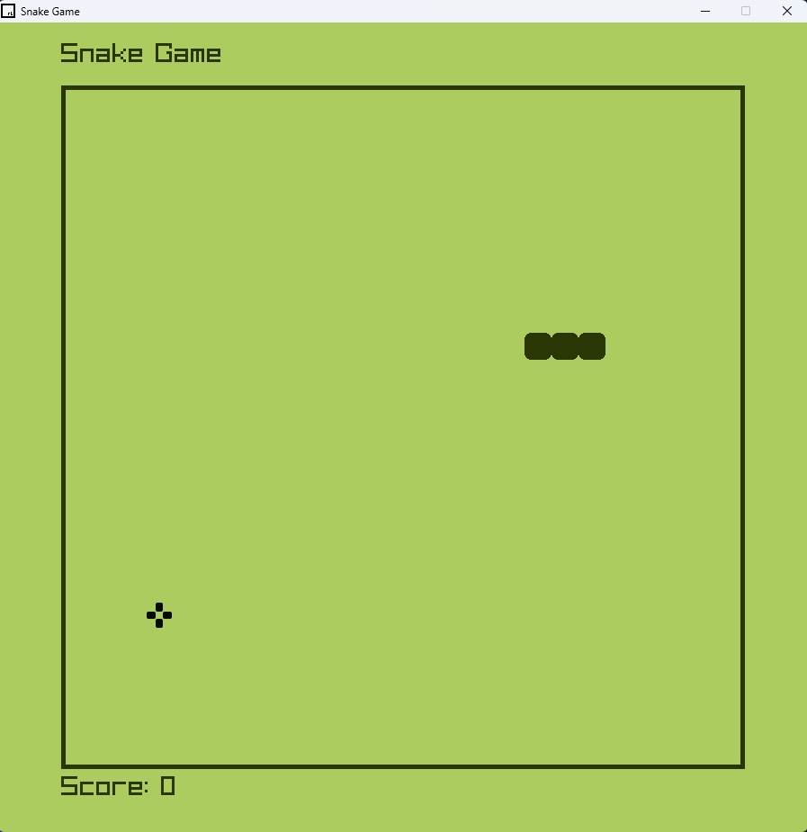

# snake-game

## Description
This is a simple snake game made with c++ and raylib library.

## How to play
- Use the arrow keys to move the snake.
- Eat the food to grow.
- Don't hit the walls or yourself.

## How to run
- Clone the repository.
- Install raylib library.
- Press F5 to compile and run the game with Visual Studio Code.
- Run the executable file with the following command:
```
./snake
```

## Screenshots
